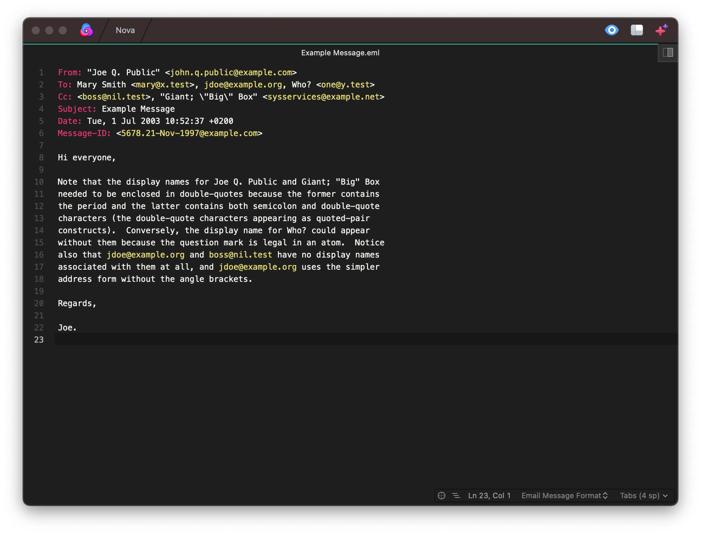

**Email** opens EML file and provides syntax highlighting to **RFC5322 Messages**.

## Language Support

<!--
🎈 Whether your extension covers the entirety of a language's syntax or a subset, it can be helpful to describe that for users:
-->

Email currently supports the following features of Important Language:

- All standard field names
- X-headers
- MIME Fields
- Email Address highlighting

Support for:

- SPF Highlighting
- DKIM Highlighting
- DMARC Highlighting 

is planned for a future update.
